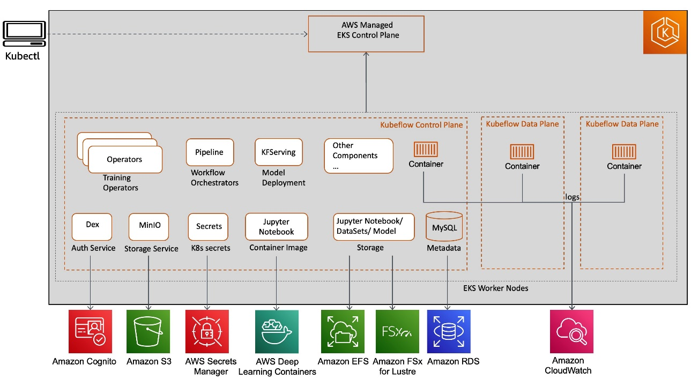

# 👋 Equilibrium Energy DevOps Interview

## Job Description:

Equilibrium Energy - **Clean tech startup** - Building a **digital native power company**.&#x20;

Profitability Factors: **grid variability, market volatility, economic optimization, commercial structuring, and risk management**.

Wants Employees with: deep **industry expertise** combined with an unwavering commitment to modern **digital approaches**.

Product: commercial strategies, operational approaches, and product suites that offer **data-driven insights, automated workflows, ML-infused pipelines, and fully automated decision engines.**

## Job Role:

Job Role: _**DevOps Engineer (But more like Site Reliability Engineer + ArgoCD)**_

* Develop, deploy, configure, and maintain platform and application solutions internally built or acquired&#x20;
* **Infrastructure As Code** deployments and **CI/CD Pipelines** in ArgoCD&#x20;
* Participate in project planning meetings to share knowledge of **system options,** **risk, impact**, and **costs vs. benefits**. In addition, communicate operational requirements and development forecasts.
* Implement advanced monitoring and alerting (**Need to add Prometheus & Grafana & DataDog / Splunk**)
* Participate and lead in blameless post mortems to build a culture of continuous improvement

## Thoughts on Company Architecture:

* Kubernetes clusters in multiple regions&#x20;
* EKS ( Amazon managed kubernetes service)\* could use multicloud cluster for reliability
  * namespace per client
* Manage infrastructure in terraform\* future use terraform enterprise to create modules and registries
* SWE Dockerize workloads for applications
* Temporal for workflow orchestration for application code
* Postgres Cluster to store transaction data, customer data, client data, etc.
  * New database per client
  * table structure similar per client
  * Postico to connect to db
* Gitlab to host source code
* ArgoCD for CI/CD pipelines that run in kubernetes \* ! instead of gitlab runners why?
* Monitoring using AWS Cloud Watch\* room for improvement using promethus\&grafana, datadog, splunk, etc.
* Oncall alerting using PagerDuty

## System Architecture Diagram:

* Kubeflow on EKS
* Replace RDS with High Availability Postgres
* CloudWatch for Monitoring

<figure><figcaption></figcaption></figure>

## Better Kubernetes Monitoring Stack:

Prometheus for Monitoring & Grafana for Visualization

Cloud Knative stack for native Kubernetes monitoring

<figure><figcaption></figcaption></figure>

## Future Organization Development:

Build a Site Reliability Engineering culture. Kitchen Sink -> Infrastructure

Kitchen Sink: Startup where SRE responsibilities are unbound

Infrastructure: SRE works on shared services like Kubernetes deployment specs, or common components like CI/CD pipelines, monitoring, VPC, Networking, IAM, etc.&#x20;

### **7 SRE Principles**

1. Embracing Risk
2. Service Level Objectives
3. Eliminating toil
4. Monitoring
5. Release Engineering
6. Automation
7. Simplicity

